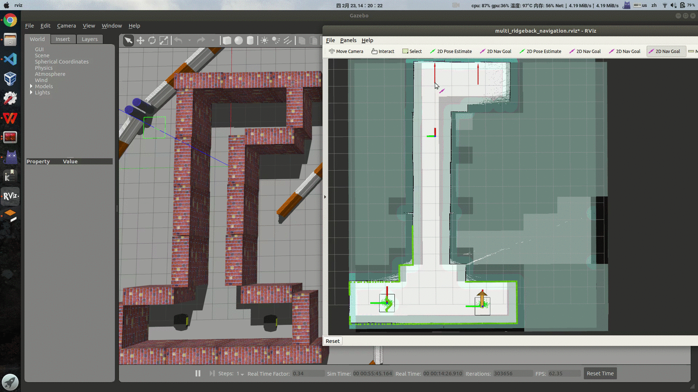
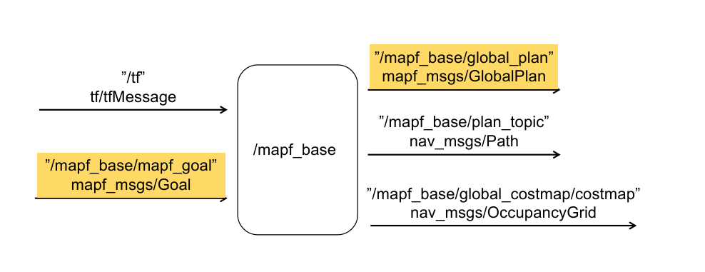
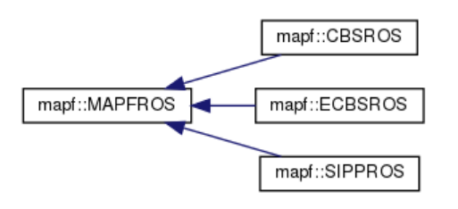

# Multi-Agent Path Finding (MAPF) in ROS

中文版本文档在[README.md](https://github.com/speedzjy/mapf_ros/blob/main/README.md)

---------------------------------------------

<!-- TOC -->

- [Multi-Agent Path Finding (MAPF) in ROS](#multi-agent-path-finding-mapf-in-ros)
  - [Introduction](#introduction)
  - [Example](#example)
    - [Conflict-Based Search (CBS)](#conflict-based-search-cbs)
      - [Reference](#reference)
    - [Enhanced Conflict-Based Search (ECBS)](#enhanced-conflict-based-search-ecbs)
      - [Reference](#reference-1)
    - [Prioritized Planning using SIPP](#prioritized-planning-using-sipp)
      - [Reference](#reference-2)
  - [Build](#build)
  - [Launch](#launch)
    - [example launch](#example-launch)
    - [Notes: (very importment)](#notes-very-importment)
  - [Introduction of Code Structure](#introduction-of-code-structure)
    - [Nodes](#nodes)
      - [1 mapf\_base](#1-mapf_base)
        - [1.1 Node sturcture](#11-node-sturcture)
        - [1.2 Subscribed Topics](#12-subscribed-topics)
        - [1.3 Published Topics](#13-published-topics)
        - [1.4 Parameters](#14-parameters)
      - [2 goal\_transformer](#2-goal_transformer)
        - [2.1 Node sturcture](#21-node-sturcture)
        - [2.2 Subscribed Topics](#22-subscribed-topics)
        - [2.3 Published Topics](#23-published-topics)
        - [2.4 Parameters](#24-parameters)
      - [3 plan\_executor](#3-plan_executor)
        - [3.1 Node sturcture](#31-node-sturcture)
        - [3.2 Subscribed Topics](#32-subscribed-topics)
        - [3.3 Published Topics](#33-published-topics)
        - [3.4 Parameters](#34-parameters)
      - [4 whole nodes graph](#4-whole-nodes-graph)
    - [ROS plugin picture](#ros-plugin-picture)

<!-- /TOC -->
<!-- /TOC -->

## Introduction
In order to verify the multi-agent path planning algorithms on **ROS**, 
this repository writes a **ROS wrapper** on the core code of some mapf algorithms(which mainly come from [HERE](https://github.com/whoenig/libMultiRobotPlanning)) as **ros plugins**. The content of [this repository](https://github.com/atb033/multi_agent_path_planning) also provides a lot of help.

The following algorithms are currently implemented:

+ Conflict-Based Search (CBS)
+ Enhanced Conflict-Based Search (ECBS)
+ Prioritized Planning using SIPP(**example code** for SIPP, the code to check swap has not been written yet)

## Example

### Conflict-Based Search (CBS)

Conflict Based Search(CBS) guarantees **optimal** solutions. CBS is a two-level algorithm where the high level search is performed in a constraint tree (CT) whose nodes include constraints on time and location for a single agent. At each node in the constraint tree a low-level search is performed to find new paths for all agents under the constraints given by the high-level node.

On the low-level of the implementation, A* is used to find paths for individual agents.


#### Reference

- [Conflict-based search for optimal multi-agent path finding](https://doi.org/10.1016/j.artint.2014.11.006)

### Enhanced Conflict-Based Search (ECBS)

Enhanced Conflict-Based-Search (ECBS) provides a **suboptimal** solution for multi-agent path finding. In other words, ECBS provides a "quick" solution, rather than the optimal solution
provided by CBS.


#### Reference

- [Suboptimal Variants of the Conflict-Based Search Algorithm for the Multi-Agent Pathfinding Problem](https://doi.org/10.1609/socs.v5i1.18315)

### Prioritized Planning using SIPP

 Safe Interval Path Planning(SIPP) is a local planner for a single agent, using which, a collision-free plan can be generated, after considering the static and dynamic obstacles in the environment.In the case of multi-agent path planning with priority, the other agents in the environment are considered as dynamic obstacles. The trajectory of the agent that plans first will be regarded as the dynamic obstacle trajectory attached to the constraints of the agents that plan later.

 The implementation of Prioritized Planning using SIPP is an **example code**. The code to check swap has not been written yet.

|           No swap (Success)           |
|:------------------------------------:|
| |

|           Swap (Failure)           |
|:------------------------------------:|
| |

#### Reference

- [SIPP: Safe Interval Path Planning for Dynamic Environments](https://www.cs.cmu.edu/~maxim/files/sipp_icra11.pdf)

## Build

The same process as the ros code package, just:

```bash
catkin_make
```

## Launch

Take a look at the [code structure bellow](#code_structure), it might help.

The following is the sample code for launch, which is placed in the [mapf_base/launch](https://github.com/speedzjy/mapf_ros/blob/main/mapf_base/launch/mapf_example.launch)
### example launch
```xml
<launch>

  <!-- 1.load the low resolution map -->
  <arg name="map" default="mymap_low_resolution.yaml" />
  <group ns="mapf_base">
    <node name="map_server" pkg="map_server" type="map_server" args="$(find ros_package_name)/maps/$(arg map)" />
  </group>

  <!-- 2. launch mapf_base node -->
  <node pkg="mapf_base" type="mapf_base" name="mapf_base" output="screen" respawn="true">
    <rosparam file="$(find mapf_base)/params/costmap_params.yaml" command="load" ns="global_costmap" />
    <rosparam file="$(find mapf_base)/params/mapf_params.yaml" command="load" />

    <!-- name of mapf_planner; possible values: {
    mapf_planner/CBSROS, 
    mapf_planner/ECBSROS,
    mapf_planner/SIPPROS
    } -->
    <param name="mapf_planner" value="mapf_planner/SIPPROS" />
    <!-- <rosparam file="$(find mapf_base)/params/ecbs_params.yaml" command="load" /> -->
  </node>

  <!-- 3. launch goal_transformer and plan_executor -->
  <group ns="mapf_base">
    <node pkg="mapf_base" type="goal_transformer" name="goal_transformer" output="screen"> </node>
    <node pkg="mapf_base" type="plan_executor" name="plan_executor" output="screen"> </node>
  </group>

</launch>
```

There are three param files that need to be configured: [mapf_params.yaml](https://github.com/speedzjy/mapf_ros/blob/main/mapf_base/params/mapf_params.yaml), [costmap_params](https://github.com/speedzjy/mapf_ros/blob/main/mapf_base/params/costmap_params.yaml) and [ecbs_params.yaml](https://github.com/speedzjy/mapf_ros/blob/main/mapf_base/params/ecbs_params.yaml)(If choose ecbs planner).

### Notes: (very importment)
It is **strongly recommended** to use **low-resolution maps for mapf planning** search and **high-resolution maps for local planning** with a single robot. The reasons are as follows:

- Both CBS and ECBS are space-time searches, if the map dimension is too high, the search will be extremely time-consuming. Solving MAPF optimally (i.e., finding a conflict-free solution of minimal cost) is NP-Complete.
- Since the paths planned by mapf have time steps, in order to ensure that the robots do not collide, the minimum distance between each time step must be greater than the diameter of the robot.

----------------------------------------------------
<a id="code_structure"></a>

## Introduction of Code Structure
### Nodes
#### 1 mapf_base

##### 1.1 Node sturcture
The mapf_base node is the central control node just like move_base in ros navigation package.

**Notes: The mapf_base node only generates plans and does not publish control commands. A possible control method is to send the move_base goals to execute the control commands according to the time step of the plan.**



##### 1.2 Subscribed Topics
- /mapf_base/mapf_goal [mapf_msgs/Goal] A set of goals for each agent that mapf_base pursues in the world.
- /tf [tf/tfMessage] transforms from map to base_link of each agent

##### 1.3 Published Topics
- /mapf_base/**parameter: plan_topic** [nav_msgs/Path] | gui path to show in rviz
- /mapf_base/global_plan [mapf_msgs/GlobalPlan] | global solution: A set of single plans with timestep
- /mapf_base/global_costmap/costmap [nav_msgs/OccupancyGrid] | costmap of map from map_server node

##### 1.4 Parameters
- ~mapf_planner: (string, default: "mapf_planner/CBSROS")
- ~agent_num: (int, default: 2) | the number of agents.
- ~global_frame_id: map (string, default: map) | global frame_id in /tf.

- ~planner_time_tolerance: 5.0 (double, default: DBL_MAX) | due to mapf algorithm consumes a lot of time, if the time limit is exceeded, the algorithm will automatically exit.
- ~goal_tolerance: 1.0 (double, default: 1.0) | mapf_base node will execute mapf algorithm in a loop until the goal is reached, this parameter is better set to be the same as the map resolution

- ~base_frame_id: (string, default: "base_link") | the frame_id for each agent in the map, example:
  - base_frame_id:
    - agent_0: rb_0/base_link
    - agent_1: rb_1/base_link

- ~plan_topic: (string, default: "plan") | which will be used to publish gui path in rviz, example:
  - plan_topic:
    - agent_0: rb_0/plan
    - agent_1: rb_1/plan

----------------------------------------

The following are example nodes for test mapf algorithm.

#### 2 goal_transformer

##### 2.1 Node sturcture
This node combines individual goal information into mapf format.


##### 2.2 Subscribed Topics
- **parameter: goal_topic** [geometry_msgs/PoseStamped]
- /mapf_base/goal_init_flag [std_msgs/Bool] | if true, this node will pub mapf_goal

##### 2.3 Published Topics

- /mapf_base/mapf_goal [mapf_msgs/Goal] | send to mapf_base node

##### 2.4 Parameters

- ~goal_topic: (string, default: "rb_0/goal") | used to receive goal for each agent, example:
  - goal_topic:
    - agent_0: rb_0/goal
    - agent_1: rb_1/goal

#### 3 plan_executor

##### 3.1 Node sturcture
This node sends the received mapf plan to move_base according to time step.


##### 3.2 Subscribed Topics
- /mapf_base/global_plan [mapf_msgs/GlobalPlan] | the global plan from mapf_base

##### 3.3 Published Topics

- /**agent_name**/move_base/goal [move_base_msgs/MoveBaseActionGoal]

##### 3.4 Parameters
- ~agent_name: (string, default: "rb_0") | set the agent name (topic "(arg agent_name)/move_base/goal" will be send to move_base) according to the agent_num param, example:
  - agent_name:
    - agent_0: rb_0
    - agent_1: rb_1

#### 4 whole nodes graph


---------------------------
### ROS plugin picture



