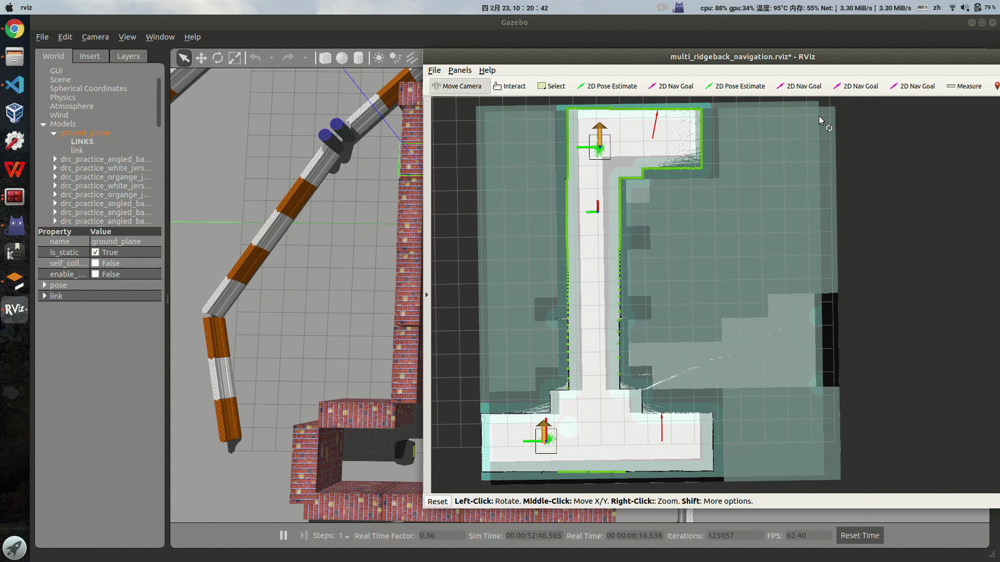

# Multi-Agent Path Finding (MAPF) in ROS

## Introduction
In order to verify the multi-agent path planning algorithms on **ROS**, 
this repository writes a **ROS wrapper** on the core code of some mapf algorithms(which mainly come from [HERE](https://github.com/whoenig/libMultiRobotPlanning)) as **ros plugins**. The content of [this repository](https://github.com/atb033/multi_agent_path_planning) also provides a lot of help.

The following algorithms are currently implemented:

+ Conflict-Based Search (CBS)
+ Enhanced Conflict-Based Search (ECBS)
+ Prioritized Planning using SIPP(**example code** for SIPP, the code to check swap has not been written yet)

## Build

The same process as the ros code package, just:

```
catkin_make
```

## Example

### Conflict-Based Search (CBS)

Conflict Based Search(CBS) guarantees **optimal** solutions. CBS is a two-level algorithm where the high level search is performed in a constraint tree (CT) whose nodes include constraints on time and location for a single agent. At each node in the constraint tree a low-level search is performed to find new paths for all agents under the constraints given by the high-level node.

On the low-level of the implementation, A* is used to find paths for individual agents.


#### Reference

- [Conflict-based search for optimal multi-agent path finding](https://doi.org/10.1016/j.artint.2014.11.006)

### Enhanced Conflict-Based Search (ECBS)

Enhanced Conflict-Based-Search (ECBS) provides a **suboptimal** solution for multi-agent path finding. In other words, ECBS provides a "quick" solution, rather than the optimal solution
provided by CBS.



#### Reference

- [Suboptimal Variants of the Conflict-Based Search Algorithm for the Multi-Agent Pathfinding Problem](https://doi.org/10.1609/socs.v5i1.18315)

### Prioritized Planning using SIPP

 Safe Interval Path Planning(SIPP) is a local planner for a single agent, using which, a collision-free plan can be generated, after considering the static and dynamic obstacles in the environment.In the case of multi-agent path planning with priority, the other agents in the environment are considered as dynamic obstacles. The trajectory of the agent that plans first will be regarded as the dynamic obstacle trajectory attached to the constraints of the agents that plan later.


## Introduction of Code Structure
### ROS plugin picture


